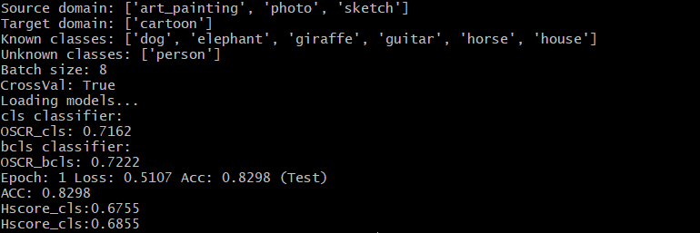

# Neurips2024 - poster- Advancing Open-Set Domain Generalization Using Evidential Bi-Level Hardest Domain Scheduler

## Instruction for the code running

please first prepare the environment following environment.yml

The PACS dataset can be downloaded via Kaggle. DigitsDG dataset and the OfficeHome dataset are all publicly available online.

Download links of the datasets will be provided after the review procedure. 

## Sample for the results reproduction

please first set the dataset path to the correct path for PACS dataset.

Then execute python test_domain_scheduler.py

The model weight can be downloaded from the following anonymous link, please use this model weight to replace the file path during test time

https://drive.google.com/file/d/1gUI2V0MIYO2y0V0_Br6KfNecbdlE4zEZ/view?usp=sharing

You will get the following results on PACS when using cartoon as the target domain.

Thank you!

